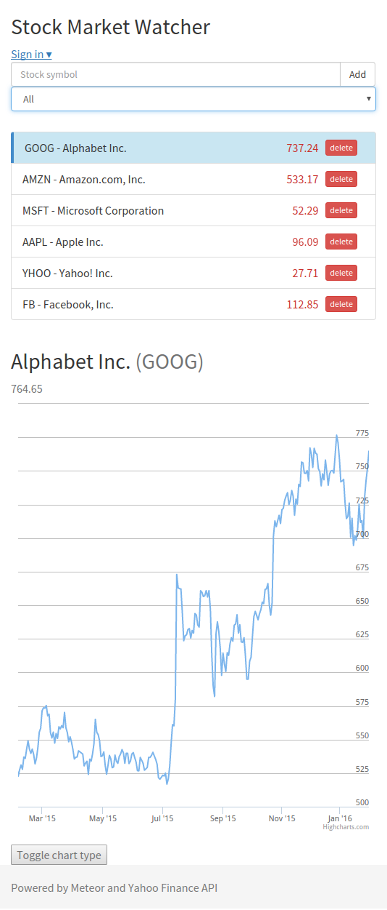

# Stock Market Watcher ###

A Stock Market application built with [Meteor](https://www.meteor.com/) utilizing the [Yahoo Finance API](http://finance.yahoo.com/)

Built to test and explore Meteor with information from various web sources.


## Features
* Auto-refresh every 10sec
* Historical quote data (365-day line/OHLC chart)
* Filter trending quotes

## Packages
```
meteor remove insecure autopublish

meteor add twbs:bootstrap reactive-var
meteor add ajbarry:yahoo-finance jhuenges:highstock
meteor add accounts-ui accounts-password
```




### License
[The MIT License](LICENSE.md)
